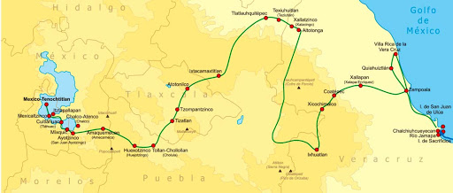

# Маршрут Эрнана Кортеса

21 апреля 1519 Эрнан Кортес высадился на месте, где позже им был основан [город Веракрус](https://en.wikipedia.org/wiki/Veracruz_(city))).  
Мексиканские туземцы встретили чужеземцев приветливо. Император ацтеков Монтесума прислал  
испанцам богатые подарки, думая, что, получив их, они удалятся восвояси. Но эти роскошные дары  
лишь разожгли алчность завоевателей и побудили их продолжать своё предприятие. Кортес решил  
воспользоваться враждой подвластного мексиканского государства Тласкалы к господствующим над ним ацтекам.  
Предав огню свои корабли, он 16 августа 1519 направился вглубь страны с 500 пехотинцами, 16 всадниками  
и 6 орудиями, к которым присоединились еще 400 солдат местного князька Семпоалы. Тласкаланцы сначала  
яростно напали на испанцев, но были отражены и присоединились к Кортесу, в количестве 600 человек.  

**А потом**
*Жители Чолулу задумали внезапно напасть на Кортеса и его людей. Но он наказал их с такой свирепостью,  
что вслед за этим все города по пути к ацтекской столице Теночтитлану (Мехико) сдавались испанцам без сопротивления.*

Монтесума встретил Кортеса 8 ноября 1519 перед воротами столицы и велел предоставить испанцам дворец, который Кортес тут же укрепил пушками. Но вскоре один полководец Монтесумы, по его приказанию, напал на испанское береговое поселение. Кортес в ответ захватил Монтесуму и держал его под стражей в испанском лагере. Пленный государь, с которым завоеватели обращались жестоко и унизительно, формально продолжал править, но Кортес вынудил его признать себя вассалом Испании и согласиться на уплату дани. Испанцы захватили в Теночтитлане огромную добычу.

# карта маршрута:  

